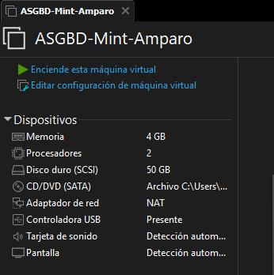
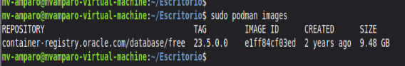
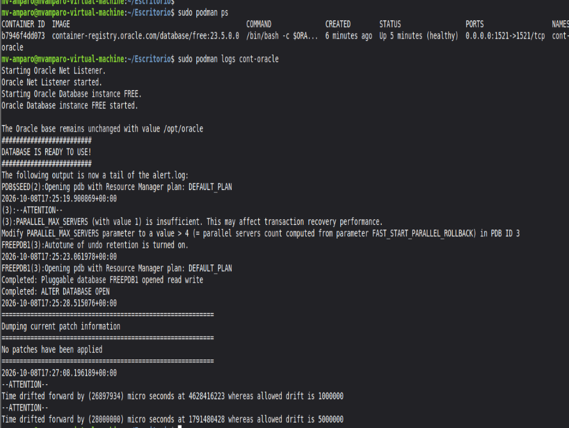
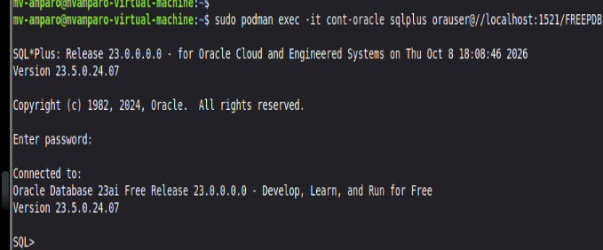
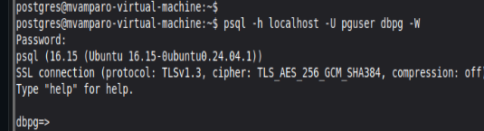
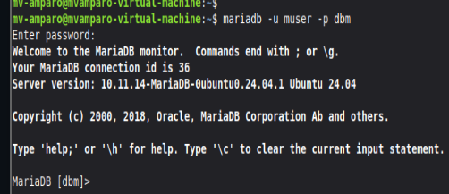
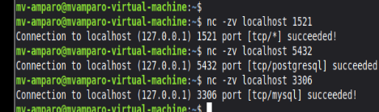
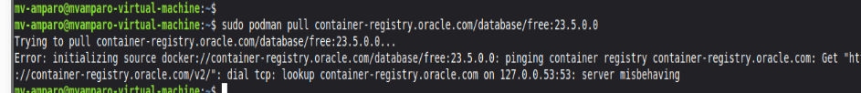
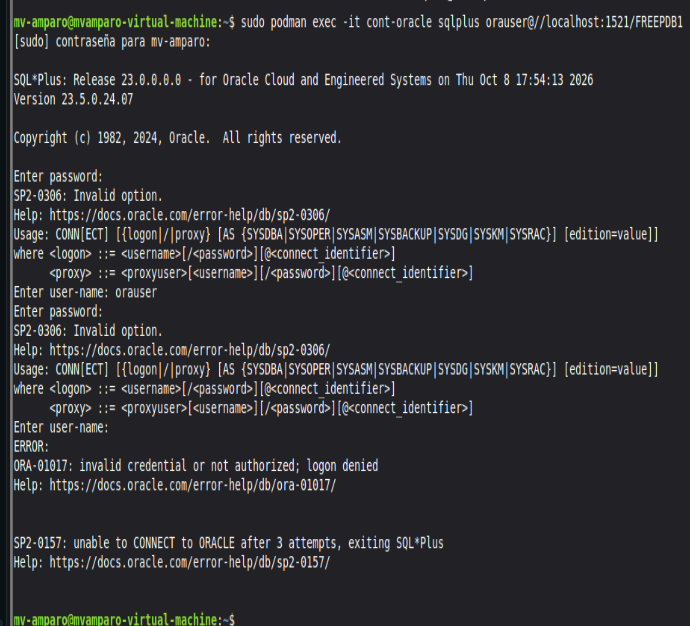

# **Tarea 2.2 - Instalar tres SGBD**
##### _Amparo Sánchez Ledo - ASIR 2 - 07/10/2026_

<!--Nota: la carpeta de evidencias/ es la misma que img/-->


> Las características de la máquina son: 4GB de RAM, 2CPU y 250GB de almacenamiento. En esta tarea, usaré un Linux Mint (reutilizado de tareas anteriores).



## **_1. Desplegar Oracle Database 23 ai Free con Podman_**

> **Versión de la imagen:** `container-registry.oracle.com/database/free:23.5.0.0`

### **_Preparación y descarga_**

En esta práctica, vamos a desplegar Oracle con el uso de Podman. Esto sigue ciertos pasos:

1. Primero, debemos _actualizar los paquetes del sistema_ con `sudo apt update`.

2. Ya actualizados los paquetes, instalamos Podman con `sudo apt install podman`.

3. Descargamos la imagen oficial del contenedor con `sudo podman pull container-registry.oracle.com/database/free:23.5.0.0`.

4. Y ejecutamos `sudo podman images` para comprobar que la imagen se ha descargado correctamente:



### **_Creación y comprobación del contenedor_**

Para poder evitar la pérdida de información (en caso de que se detenga o recree el contenedor), creamos un volumen persistente. Usaremos el comando `sudo podman volume create oracle_23ai_datos`.

Seguidamente, levantamos el contenedor publicando el puerto 1521 de la máquina y le asociamos el volumen que acabamos de crear. Usaremos el comando `sudo podman run -d --name cont-oracle -p 1521:1521 --restart=always -v oracle_23ai_datos:/opt/oracle/oradata:U container-registry.oracle.com/database/free:23.5.0.0`.

> La opción de _--restart=always_ hace que el connenedor vuelva a arrancar de manera automática en caso de que la máquina se reinicie.

Y verificamos que el contenedor esté funcionando (estado _healthy_) con `sudo podman ps`, y vemos los registros con `sudo podman logs cont-oracle`:



### **_Creación del usuario de trabajo en Oracle_**

Pasamos a la creación del usuario. Una vez inicializado el contenedor, entraremos como administrador a SQL*Plus con `sudo podman exec -it cont-oracle sqlplus / as sysdba`.

Una vez dentro, ejecutamos las siguientes sentencias para movernos a la PBD, crear el usuario dentro y darle permisos:
```
ALTER SESSION SET CONTAINER = FREEPDB1;
CREATE USER orauser IDENTIFIED BY "TU_CLAVE";
GRANT CREATE SESSION, CREATE TABLE TO orauser;
ALTER USER orauser QUOTA 100M ON USERS;
EXIT
```

Y comprobamos la conexión con el uso del comando `sudo podman exec -it cont-oracle sqlplus orauser@//localhost:1521/FREEPDB1`:



Una vez ya comprobado que se conecta, ya hemos terminado con Oracle + Podman.

---

## **_2. Desplegar PostgreSQL_**

> **Versión instalada:** `psql (PostgreSQL) 16.15`

### **_Preparación y descarga_**

Pasamos al siguiente gestor, PostgreSQL. Al igual que con Oracle, seguimos los siguientes pasos:

1. Actualizamos (de nuevo) los paquetes del sistema con `sudo apt update`.

2.  Instalamos el servidor de PostgreSQL con las herramientas usando `sudo apt install postgresql postgresql-contrib php-pgsql`.

3. Ya instalado, iniciamos y habilitamos el servicio con `sudo systemctl start postgresql` y `sudo systemctl enable postgresql`.

### **_Creación de usuario y base de datos_**

Comenzamos con la creación de usuario y la base de datos. Para ello, entramos como administrador con `sudo -i -u postgres` y escribirmos `psql` seguidamente.

Ya dentro de psql, creamos la base de datos y el usuario con los siguientes comandos de consultas:

```
CREATE DATABASE dbpg;
CREATE USER pguser WITH PASSWORD 'tu_clave_aqui';
GRANT ALL PRIVILEGES ON DATABASE dbpg TO pguser;
\q
```

### **_Comprobar conexión_**

Ya creado el usuario y la base de datos, comprobamos la conexión con `psql -h localhost -U pguser dbpg -W`:



Como vemos, se ha conectado. Y con esto ya tenemos también instalado PostgreSQL.

---

## **_3. Desplegar MariaDB_**

> **Versión instalada:** `mariadb Ver 15.1 Distrib 10.11.14-MariaDB`

### **_Preparación y descarga_**

Por último, instalaremos MariaDB. También sigue ciertos pasos:

1. Al igual que en los casos anteriores, comenzamos actualizando paquetes (por si acaso) con el uso del comando `sudo apt update`.

2. Ahora, instalamos MariaDB con `sudo apt install mariadb-server mariadb-client`.

3. Y habilitamos el servicio con `sudo systemctl enable --now mariadb`.

## **_Creación de usuario y base de datos_**

Ahora crearemos la base de datos y el usuario. Para ello entramos con `sudo mariadb` y una vez ya dentro, escribiremos los siguientes comandos de consulta:

```
CREATE DATABASE dbm CHARACTER SET utf8mb4 COLLATE utf8mb4_unicode_ci;
CREATE USER 'muser'@'localhost' IDENTIFIED BY 'TU_CLAVE';
GRANT ALL PRIVILEGES ON dbm.* TO 'muser'@'localhost';
FLUSH PRIVILEGES;
EXIT;
```

### **_Comprobar conexión_**

Y finalizamos comprobando la conexión con `mariadb -u muser -p dbm`:



Ya visto que se ha conectado, damos por finalizada la instalación y configuración.

---

## **_4. Resumen y comprobaciones_**

| SGBD | IP | Base/Servicio | Puerto | Usuario | Contraseña |
| --- | --- | --- | --- | --- | --- |
| Oracle 23ai Free | IP de la VM / localhost | FREEPDB1 | 1521 | orauser | Elegida |
| PostgreSQL | localhost | dbpg | 5432 | pguser | Elegida |
| MariaDB | localhost | dbm | 3306 | muser | Elegida |

Comprobamos que podamos acceder con cada puerto:



Que como podemos ver, las tres conexiones fueron un éxito.

---

## **_5. Conexiones desde la máquina_**

> Antes de comenzar con las conexiones, debemos verificar las ip de la máquina virtual y la máquina real.

Algunos SGBD se instalan escuchando solo en localhost. En caso de que queramos acceder desde otro equipo, comprobaremos primero el modo de red de la VM, la IP y las reglas del firewall. Abriremos las conexiones necesarias solamente.

**_PostgreSQL_**

1. Localizamos el postgresql.conf y cambiamos listen_addresses para que el gestor escuchche en la IP de la VM (en caso de que se indique, en todas las interfaces). Usamos el comando `sudo nano /etc/postgresql/*/main/postgresql.conf` para editar la configuración y escribir lo siguiente:

`listen addresses = '192.168.248.128'`

2. Ahora localizamos pg_hba.conf en ese mismo directorio (usando `sudo nano /etc/postgresql/*/main/pg_hba.conf`) y le damos permiso a nuestra red escribiendo la siguiente línea al final del todo del fichero de configuración:

`host dbpg pguser 192.168.248.0/24 scram-sha-256`

3. Guardamos ambos archivos y reiniciamos PostgreSQL con `sudo systemctl restart postgresql`.

4. En caso de que UFW esté activo, permitimos el puerto 5432 solo desde esa red. Probamos desde otra máquina con los siguientes comandos:

`sudo ufw allow from 192.168.248.0/24 to any port 5432 proto tcp`

`psql -h 192.168.248.128 -U pguser -d dbpg -W`

---

**_MariaDB_**

1. Empezamos buscando el archivo de configuración (sudo nano /etc/mysql/mariadb.conf.d/50-server.cnf) y cambiamos/configuramos esta línea de la siguiente manera:

`bind-address = 192.168.248.128`

2. Creamos el usuario remoto con `sudo mariadb` y copiamos y pegamos el siguiente bloque (el cual permitirá conectar el Windows):

```
CREATE USER 'muser'@'192.168.248.1' IDENTIFIED BY 'TU_CLAVE';
GRANT ALL PRIVILEGES ON dbm.* TO 'muser'@'192.168.248.1';
FLUSH PRIVILEGES;
EXIT;
```

> Nota: sustituye TU_CLAVE por la contraseña que hayas puesto y la IP por la que tengas.

3. Reiniciamos MariaDB con `sudo systemctl restart mariadb`

4. En caso de que UFW esté activo, permitimos únicamente esa IP en el puerto 3306 y probamos desde el cliente usando los siguientes comandos:

`sudo ufw allow from 192.168.248.1 to any port 3306 proto tcp`

`mariadb -h 192.168.248.128 -u muser -p dbm`

> Tanto para PostgreSQL como para MariaDB (en caso de que tengamos descargado programas como DBeaver) nos conectamos desde la máquina anfitrión a la IP 192.168.248.128 (que es la IP de la máquina virtual)

---

## **_Incidencias y resoluciones_**

- **Fallo de red durante el despliegue de Oracle:** Al ejecutar el comando `podman pull` para descargar la imagen del contenedor, la terminal devolvió un error indicando `server misbehaving`. Al revisar la configuración, Linux Mint marcaba la conexión cableada como "desconectada", de manera que al tratar de hacer ping (con Google por ejemplo) no llegaban.



> **Resolución:** Tras haber visto si la máquina tenía el problema y descartarlo, vi que el problema estaba en el sistema anfitrión (Windows), y es que tenía detenido el servicio de NAT de VMware. Para solucionarlo, he accedido a Servicios > VMware NAT Service > Iniciar

- **Fallo de conexión:** Al intentar conectarme al usuario por SQL, me saltó un error en la contraseña que no me dejaba acceder:



> **Resolución:** Comprobé que el problema venía en que la contraseña tenía caracteres especiales (en mi caso un @), así que le cambié la contraseña con el uso de las siguientes consultas SQL:

```
ALTER SESSION SET CONTAINER = FREEPDB1;
ALTER USER orauser IDENTIFIED BY PASSWORD_NUEVA;
EXIT
```

---

## **_Fuentes consultadas_**
- Guía de la práctica: "Instalar tres SGBD".
- [Documentación oficial de Oracle Database Free:](https://www.oracle.com/es/database/free/get-started/)
- Consultas a la documentación oficial de PostgreSQL y MariaDB.